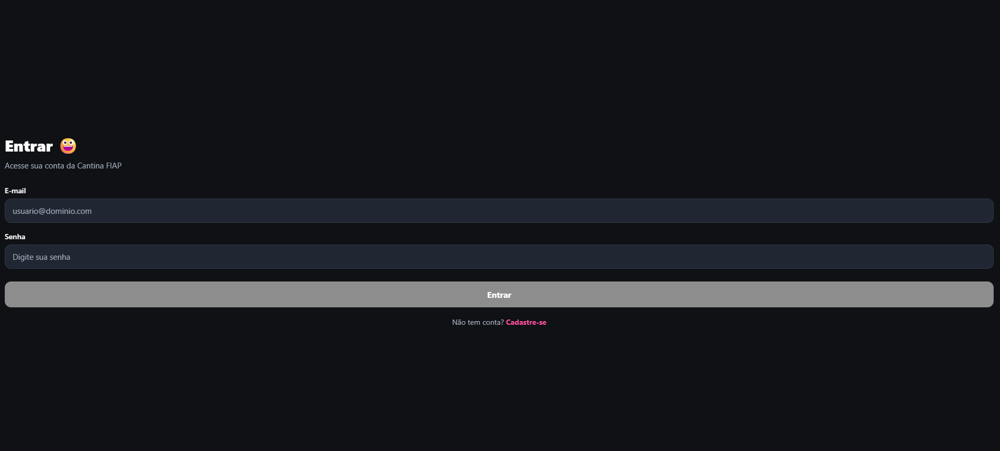
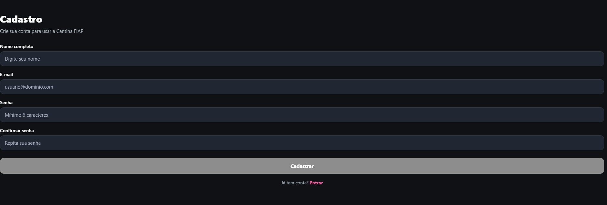
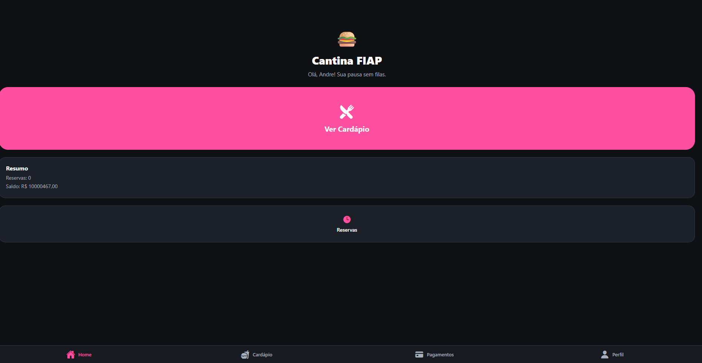
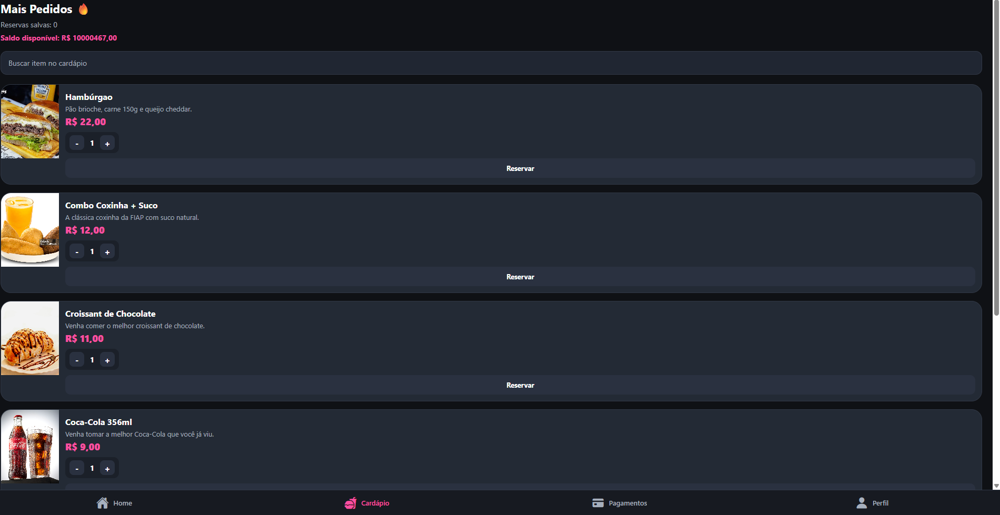
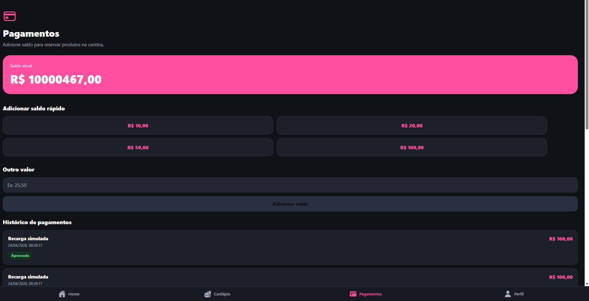
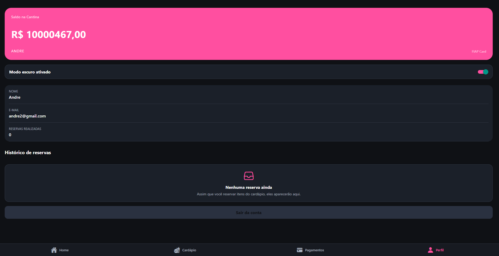

# 🍔 Cantina FIAP App

Aplicativo mobile desenvolvido em **React Native com Expo Router**, com o objetivo de simular o funcionamento de uma cantina digital, permitindo cadastro, login e reserva de produtos.

---

## 🎯 Objetivo

O projeto tem como finalidade aplicar conceitos de desenvolvimento mobile, incluindo:

* Navegação com Expo Router
* Gerenciamento de estado com Context API
* Persistência de dados local com AsyncStorage
* Organização em camadas (context, services, components)

---

## 📱 Funcionalidades

### 🔐 Autenticação

* Cadastro de usuário
* Login com validação
* Persistência de sessão
* Logout

### 🍽️ Cardápio

* Listagem de produtos
* Busca por nome/descrição
* Seleção de quantidade
* Reserva de itens

### 💰 Controle de Saldo

* Saldo inicial do usuário
* Desconto automático ao realizar reservas
* Validação de saldo insuficiente

### 📊 Histórico de Reservas

* Listagem das reservas realizadas
* Informações exibidas:

  * Nome do item
  * Quantidade
  * Preço unitário
  * Valor total
  * Data

---

## 🧠 Estrutura do Projeto

```bash
app/
  (auth)/        # telas de login e cadastro
  (tabs)/        # telas principais (home, cardápio, perfil)

context/
  AuthContext.js
  AppDataContext.js

services/
  api.js         # simulação de API

components/
  # componentes reutilizáveis
```

---

## ⚙️ Tecnologias Utilizadas

* React Native
* Expo
* Expo Router
* Context API
* AsyncStorage
* JavaScript (ES6+)

---

## 🔌 Simulação de API

O projeto utiliza um arquivo `services/api.js` para simular o comportamento de uma API REST.

Essa camada é responsável por:

* regras de negócio (saldo, reservas)
* manipulação de dados
* simulação de requisições assíncronas

---

## 💾 Persistência de Dados

Os dados são armazenados localmente utilizando:

* AsyncStorage

Informações salvas:

* usuário
* sessão
* saldo
* reservas

---

## ▶️ Como Executar o Projeto

```bash
npm install
npx expo start
```

---

## 📸 Evidências do Funcionamento

* Tela de login



* Tela de cadastro



* Home



* Cardápio



* Pagamentos



* Perfil com saldo e histórico


---

## 🚀 Melhorias Futuras

Algumas melhorias que podem ser implementadas para evolução do projeto:

* Integração com API real (Node.js ou Spring Boot)
* Persistência de dados em banco de dados externo
* Implementação de sistema de pagamento
* Sistema de favoritos no cardápio
* Notificações push para status de pedidos
* Filtro de itens por categoria (bebidas, doces, salgados)
* Histórico detalhado com gráficos de consumo

## 📌 Considerações Finais

O projeto atende aos requisitos propostos, implementando um fluxo completo de autenticação e uso da aplicação, com persistência de dados e organização em camadas, simulando um sistema real.

---

## 👨‍💻 Desenvolvedores

* Andre Luiz Fernandes de Queiroz - Rm554503
* Paulo Poças - Rm556080
* Rafael Bocchi - Rm557603
